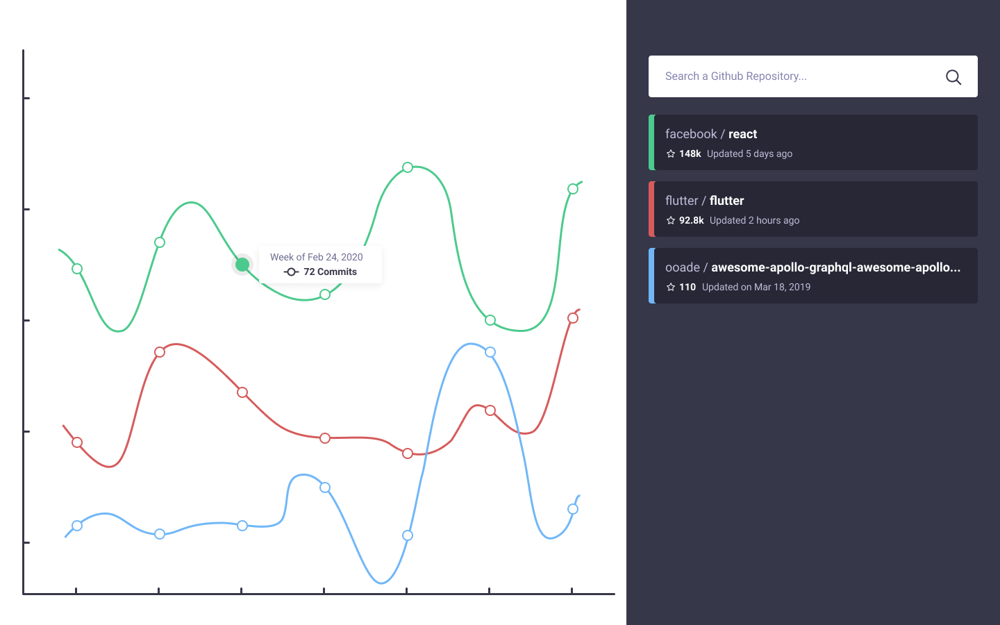

# GitHub Commit Activity Explorer

This is a code assignment by MetaLab for the position of Software Engineer (Web).

The task is to build an SPA using React and Webpack, along with any other tool that may be needed.

The app should allow the user to search public GitHub repositories through an input with autocomplete, showing the results on a popup. Selected repositories will get added to a graph, displaying their commit activity of the last year by weekly intervals.

## Getting Started

This project was bootstrapped with [Create React App](https://github.com/facebook/create-react-app), but packaged with [CRACO](https://craco.js.org) to allow an easier configuration of the project.

1. Install the node dependencies:
   - Run `npm install`
2. Set up the [environment variables](#environment-variables):
   - Copy the file `.env.example` into a `.env` file
   - Add your custom variables (a GitHub API Token is required, [create one here](https://github.com/settings/tokens))
3. Start the development server:
   - Run `npm start`
   - Go to [http://localhost:3000](http://localhost:3000)

## Tasks

1. [x] Create a `README.md` file with instructions on how to run the app
2. [x] Create `PRE_ASSIGNMENT_ANSWERS.md` and `POST_ASSIGNMENT_ANSWERS.md` files in the repo to answer the pre and post assignment questions
3. [ ] Create main page of the application
4. [ ] Create an autocomplete search bar to that allows users to search for a repository by the repositories name
5. [ ] Allow users to select a repository from the search bar to add the repository to the repository list and graph
6. [ ] Display a graph that compares the last year of commit activity grouped by week for each selected repository
7. [ ] Implement the hover state and allow the user to remove a repository from the repository list

## Environment Variables

- `PORT` (default: `3000`):
  - The app can be accessed at `http://localhost:{PORT}`
  - If the specified port is not open, it'll prompt to connect to the next available port.
- `BROWSER` (default: `system`):
  - Set to `none` to prevent from opening a new tab on each app start
- `REACT_APP_GITHUB_API_TOKEN` (required):
  - A token provided by GitHub to authenticate the API request

## Available Scripts

In the project directory, you can run:

### `npm start`

Runs the app in the development mode.\
Open [http://localhost:3000](http://localhost:3000) to view it in the browser.

The page will reload if you make edits.\
You will also see any lint errors in the console.

### `npm test`

Launches the test runner in the interactive watch mode.\
See the section about [running tests](https://facebook.github.io/create-react-app/docs/running-tests) for more information.

### `npm run build`

Builds the app for production to the `build` folder.\
It correctly bundles React in production mode and optimizes the build for the best performance.

The build is minified and the filenames include the hashes.\
Your app is ready to be deployed!

See the section about [deployment](https://facebook.github.io/create-react-app/docs/deployment) for more information.

### `npm run eject`

**Note: this is a one-way operation. Once you `eject`, you can’t go back!**

If you aren’t satisfied with the build tool and configuration choices, you can `eject` at any time. This command will remove the single build dependency from your project.

Instead, it will copy all the configuration files and the transitive dependencies (webpack, Babel, ESLint, etc) right into your project so you have full control over them. All of the commands except `eject` will still work, but they will point to the copied scripts so you can tweak them. At this point you’re on your own.

You don’t have to ever use `eject`. The curated feature set is suitable for small and middle deployments, and you shouldn’t feel obligated to use this feature. However we understand that this tool wouldn’t be useful if you couldn’t customize it when you are ready for it.

## Learn More

Read more about the technologies and libraries used in this project:

- React
  - [Main Documentation](https://reactjs.org/)
  - [Create React App](https://facebook.github.io/create-react-app/docs/getting-started)
  - [CRACO](https://craco.js.org/docs/)
- CSS Reset
  - [modern-normalize](https://github.com/sindresorhus/modern-normalize)
- Feather Icons
  - [react-feather](https://github.com/feathericons/react-feather)
  - [Website](https://feathericons.com)
- GitHub API
  - [Main Documentation](https://docs.github.com/en)
  - [Search Repositories API](https://docs.github.com/en/rest/search/search?apiVersion=2022-11-28#search-repositories)
  - [Repository Statistics API](https://docs.github.com/en/rest/metrics/statistics?apiVersion=2022-11-28#get-the-last-year-of-commit-activity)
